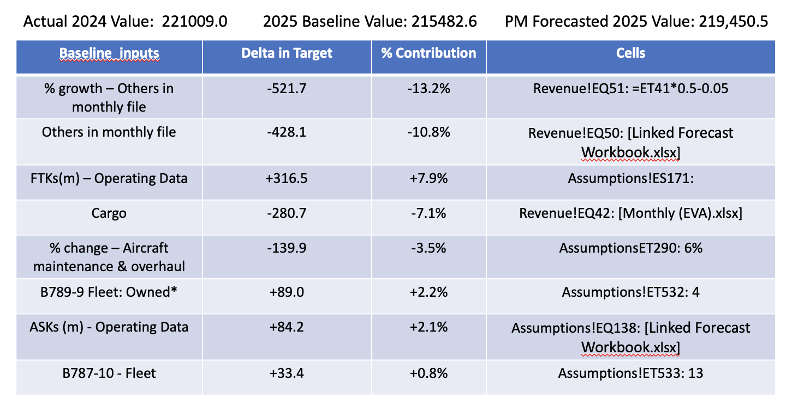

{\rtf1\ansi\ansicpg1252\cocoartf2822
\cocoatextscaling0\cocoaplatform0{\fonttbl\f0\fswiss\fcharset0 Helvetica;}
{\colortbl;\red255\green255\blue255;}
{\*\expandedcolortbl;;}
\margl1440\margr1440\vieww11520\viewh8400\viewkind0
\pard\tx720\tx1440\tx2160\tx2880\tx3600\tx4320\tx5040\tx5760\tx6480\tx7200\tx7920\tx8640\pardirnatural\partightenfactor0

\f0\fs24 \cf0 # Financial Model Attribution Engine\
\
## Overview\
\
This project is a Python-based financial model attribution and dependency tracing framework designed to automate forecast-driver analysis for Excel-based financial models.\
\
The system was originally developed to support investment research and forecasting workflows by identifying the underlying drivers contributing to forecast changes across complex multi-sheet Excel models.\
\
The framework combines:\
- recursive Excel formula tracing\
- forecast-period mapping\
- terminal input identification\
- attribution decomposition\
- automated Excel report generation\
- Flask-based workflow interaction\
\
The goal of the system is to transform opaque Excel forecast models into structured, explainable attribution outputs that help analysts and portfolio managers better understand forecast revisions and key operating drivers.\
\
---\
\
## Key Features\
\
- Recursive Excel formula dependency tracing\
- Forecast-period identification and mapping\
- Terminal forecast-driver extraction\
- Attribution analysis using baseline forcing methodology\
- Dynamic workbook parsing\
- Automated Excel output formatting\
- Flask-based web application interface\
- Multi-sheet Excel support\
\
---\
\
## Example Attribution Output\
\
Example output generated by the framework:\
\
\
\
---\
\
## Technology Stack\
\
- Python\
- Flask\
- Pandas\
- OpenPyXL\
- xlwings\
- Excel automation\
\
---\
\
## Repository Structure\
\
```text\
financial-model-attribution-engine/\
\uc0\u9474 \
\uc0\u9500 \u9472 \u9472  app.py\
\uc0\u9500 \u9472 \u9472  server.py\
\uc0\u9500 \u9472 \u9472  analysis_runner.py\
\uc0\u9500 \u9472 \u9472  full_py_run_attribution_analysis.py\
\uc0\u9500 \u9472 \u9472  Generalized Enrich Desc ipynb.ipynb\
\uc0\u9474 \
\uc0\u9500 \u9472 \u9472  templates/\
\uc0\u9474    \u9492 \u9472 \u9472  index.html\
\uc0\u9474 \
\uc0\u9500 \u9472 \u9472  utils/\
\uc0\u9474    \u9500 \u9472 \u9472  attribution_utils.py\
\uc0\u9474    \u9500 \u9472 \u9472  enrichment_utils.py\
\uc0\u9474    \u9500 \u9472 \u9472  excel_format.py\
\uc0\u9474    \u9500 \u9472 \u9472  trace_utils.py\
\uc0\u9474    \u9492 \u9472 \u9472  workbook_utils.py\
\uc0\u9474 \
\uc0\u9500 \u9472 \u9472  screenshots/\
\uc0\u9500 \u9472 \u9472  sample_data/\
\uc0\u9474 \
\uc0\u9500 \u9472 \u9472  README.md\
\uc0\u9500 \u9472 \u9472  requirements.txt\
\uc0\u9492 \u9472 \u9472  .gitignore\
```\
\
---\
\
## How It Works\
\
1. Upload or connect to an Excel forecast workbook\
2. Select:\
   - target sheet\
   - target variable\
   - forecast period\
3. The framework recursively traces Excel dependencies\
4. Terminal forecast drivers are identified\
5. Baseline forcing methodology is applied\
6. Attribution contributions are calculated\
7. A formatted attribution report is generated\
\
---\
\
## Important Note\
\
This repository contains a sanitized demonstration version of the original framework.\
\
The production workflow relied on proprietary financial models and internally linked Excel forecasting systems that are not publicly distributable.\
\
As a result:\
- sample workbooks and outputs are simplified\
- internal company infrastructure is excluded\
- certain production-specific dependencies are intentionally omitted\
\
The purpose of this repository is to demonstrate the underlying engineering architecture, attribution methodology, and Excel dependency tracing framework.\
\
\
## Author\
\
Pengxin Li\
\
MS in Financial Economics  \
Columbia Business School}